# BIO-INSPIRED VISUAL TRACKING USING ASYNCHRONOUS EVENT CAMERAS

The Pipeline of BIO-INSPIRED VISUAL TRACKING USING ASYNCHRONOUS EVENT CAMERAS:

  

&nbsp;&nbsp;

The Representative Heat Maps of Human Visual Attention:

  
  

  
  &nbsp;&nbsp;&nbsp;&nbsp;
  

The heat maps are obtained by an eye tracker on four test video sequences of the MOT20 dataset. In the heat maps, the attention is decayed with a short decay time to highlight the current concerned areas. The corresponding colors are decayed from red to blue according to the rainbow color scheme, and no color indicates no attention. The heat maps represent the historical attention over the short decay time.

&nbsp;&nbsp;

The Region of Interest (ROI) of Human Visual Tracking:

  
  
  

  
  

  

The ROIs, highlighted by red circles, are obtained by an eye tracker on the GOT-10K dataset.

Based on the above vivid illustration and solid evidence, as described in Sec. 2, when human beings track an interested target object, they generally try to gradually regress the minimum object bounding box by which tightly encloses the target region. During the coarse-to-fine bounding box regression, three key geometric factors, i.e., overlapped area, central point distance, and aspect ratio, are emphasized for evaluating the quality of the bounding box regression. Therefore, instead of the widely used ℓn-norm loss in conventional object tracking and detection methods, we introduce a composite loss function to guide the training of the proposed bio-inspired deep tracking network.

&nbsp;&nbsp;

The Tracking Trajectories of Our Bio-inspired Event-based Visual Tracking:

  
  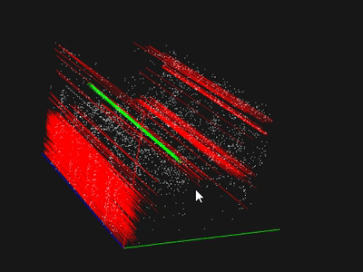

  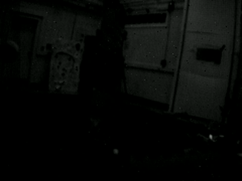
  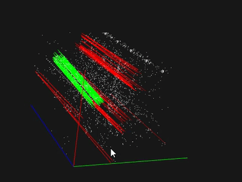

  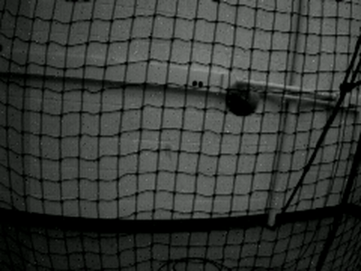
  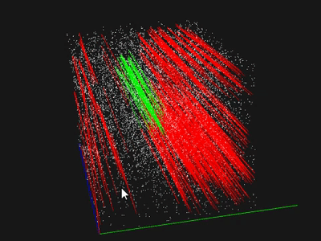

The object and camera motions are denoted in green and red lines, respectively, to show the effectiveness of our bio-inspired visual tracking in fast motion and HDR scenarios. Please note that all the results are played at much slower speeds for visualization. In addition, from the above attention heat maps and the retinal events, we can see solid evidence that both human and event cameras have a similar visual paradigm to sense the world, which is triggered by motions. As a result, event-based visual tracking is a promising way to achieve bio-inspired tracking.

&nbsp;&nbsp;

The Representative Tracking Results:

  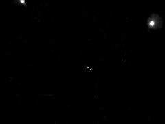
  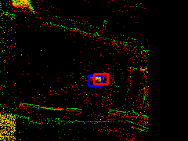

  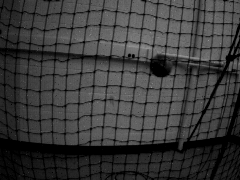
  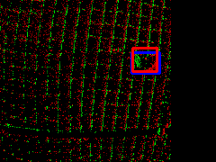

  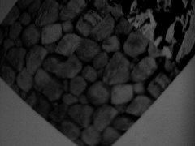
  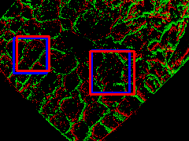

The tracking results of our BOT and the GT are highlighted by blue and red bounding boxes, respectively. Please note that all the results are played at much slower speeds for visualization.

&nbsp;&nbsp;

Representative Tracking Results of Our BOT and Competitors:

  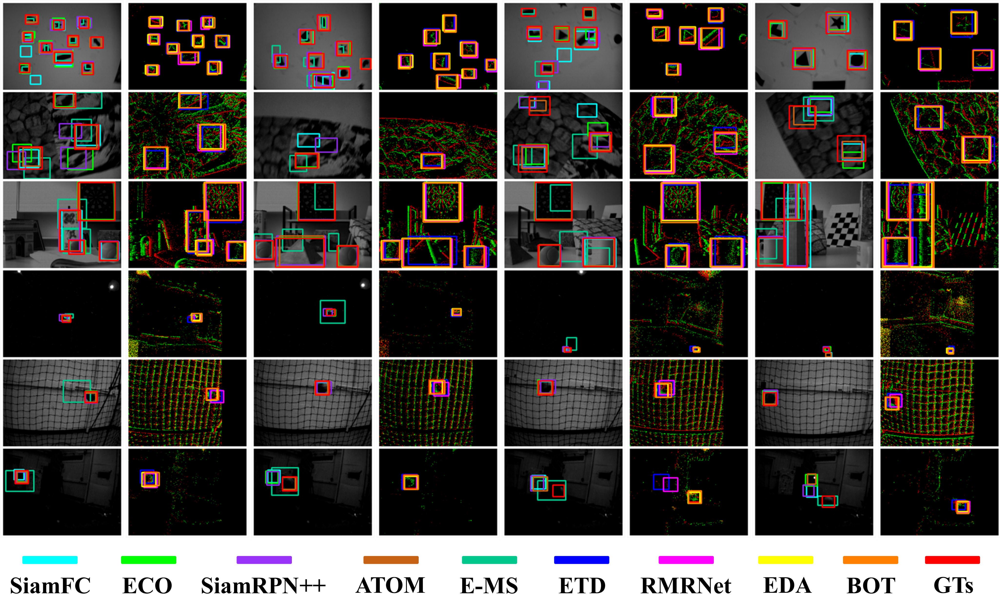

&nbsp;&nbsp;

Our code will be open-sourced for public use in this repo.

## License

This repository is licensed under the Creative Commons Attribution-NonCommercial 4.0 International License (CC BY-NC 4.0).
