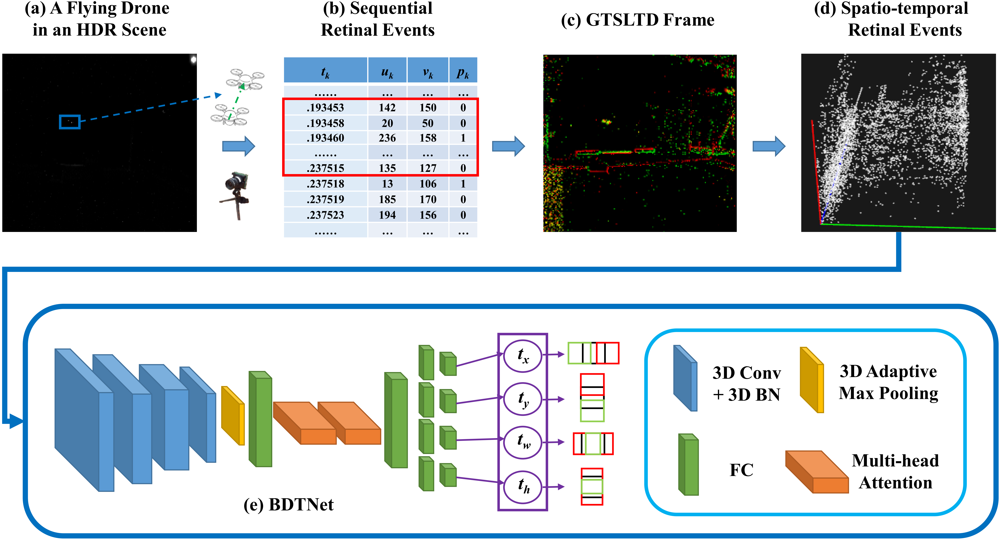
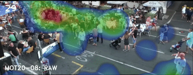
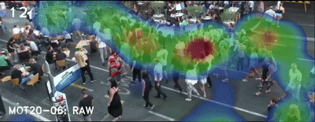
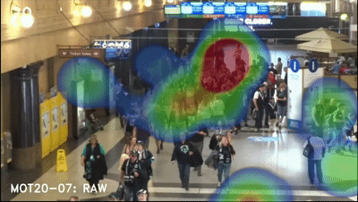
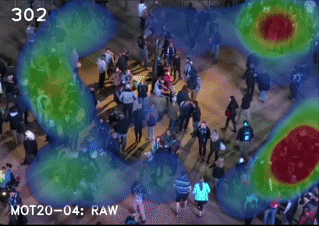
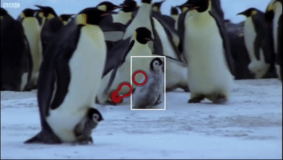
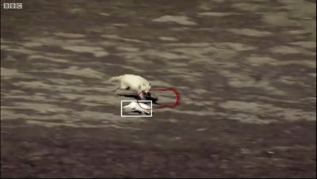
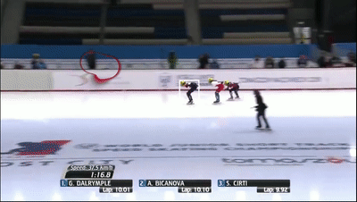
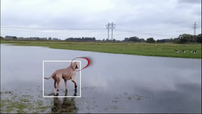
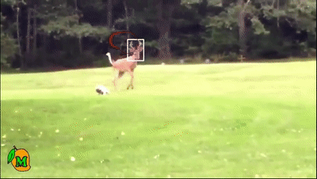

# BIO-INSPIRED VISUAL TRACKING USING ASYNCHRONOUS EVENT CAMERAS

Pipeline for BIO-INSPIRED VISUAL TRACKING USING ASYNCHRONOUS EVENT CAMERAS

  

&nbsp;&nbsp;

Solid Visual Evidence:

  
  

  
  &nbsp;&nbsp;&nbsp;&nbsp;
  

&nbsp;&nbsp;

Solid Visual Evidence:

  
  
  

  
  

  

&nbsp;&nbsp;

Solid Visual Evidence:

&nbsp;&nbsp;

## License

This repository is licensed under the Creative Commons Attribution-NonCommercial 4.0 International License (CC BY-NC 4.0).
